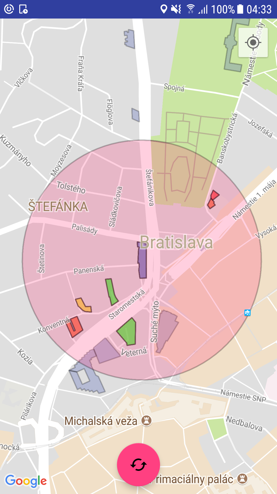
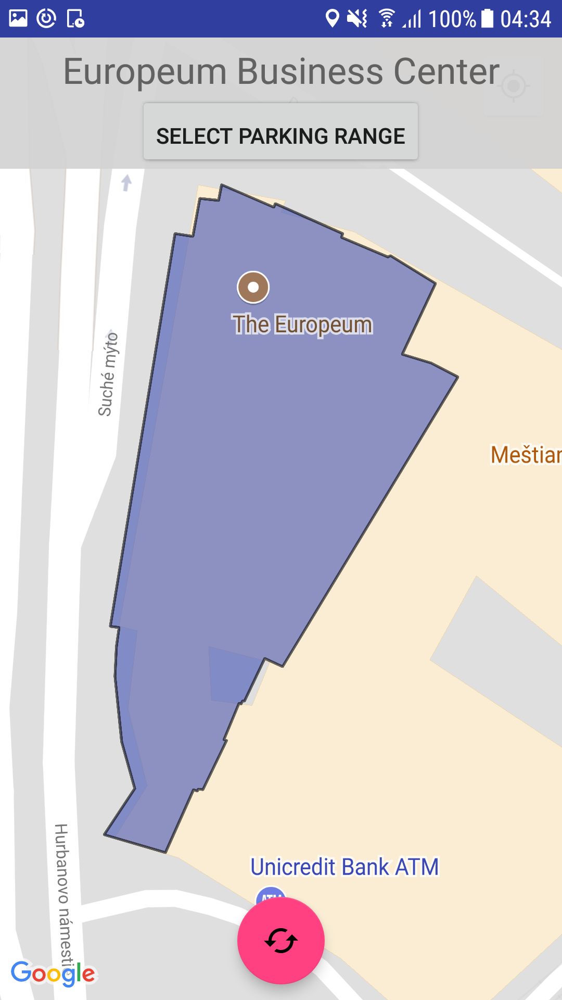
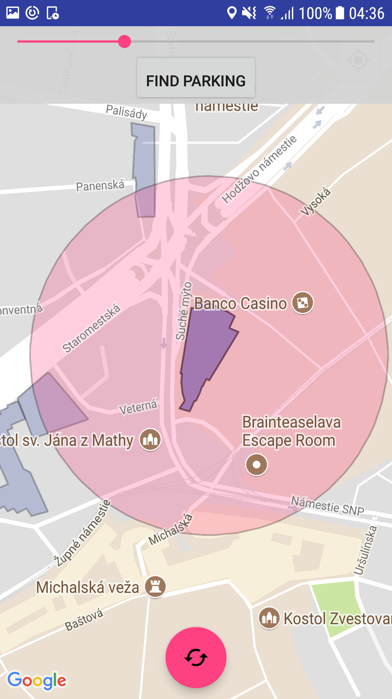
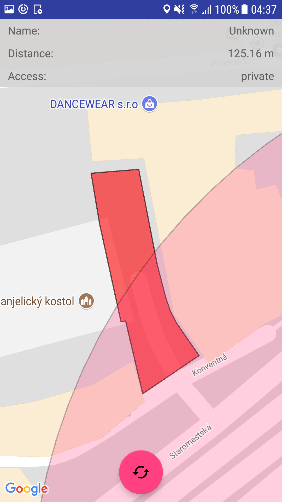

# Overview

OfficeFinder is an application that helps the user to find parking spots nearby office buildings. Use cases include:
- Finding office building near Your location
- Finding parking spots near an office building
- Calculating the distance from an office to the closest parking spots

This is the frontend in action:



The application is divided into 2 parts:
- [Android mobile frontend](#frontend)
- [.NET Core 2.0 backend](#backend)

These two parts communicate via a [REST API](#api).

# Frontend

The frontend is made of Android application written in [Kotlin](https://kotlinlang.org/). The main responsibilities of the application are:
- Render a map using Google maps
- Provide the backend with the location of the user
- Render offices and parking places on the map
- Interact with the user to provide specific office building and range
- Show details of the offices and parking places

From the android perspective, the frontend consist of a single activity. Communication with the backend REST API is handled by [Retrofit](http://square.github.io/retrofit/). Everything else is just pure Android.

## In action

**Loading the offices**: When the user taps on the ping floating button on the screen, his location is sent to the backend and all offices within 5km of his location are rendered on the map. This button also removes all previous polygons from the map

**Displaying office details**: When the user taps on an office, all other offices fade and the map pans and zooms to the selected office. The name of the office is displayed and the user is able to select a rang for parking.


**Selection of parking range**: The user is able to change the parking range with the slider. A circle is rendered, approximating the selected range.


**Displaying parking spots**: When the user specifies the range, the circle fades and stays on the map until the user selects a different range. Any parking spots within the range are rendered on the map and color-coded from green to red representing the distance of the parking spot to the office. All previous parking spots are removed from the map, so they do not clutter the UI.


**Displaying parking spot details**: When the user taps on a parking spot, the map again and zooms on the parking spot. Name and Access are displayed if available. Also the distance to the office from the parking spot is displayed.


# Backend

The backend application is written in .NET Core 2.0 WebAPI. It uses a PostgreSQL database with PostGIS extension to store all geodata. A microORM [Dapper](https://github.com/StackExchange/Dapper) is used for easier data querying.

## Data

All geographical data are from Open Street Maps. The data I used are only from Bratislava. The queries can be found in the `OfficeRepository.cs` and `ParkingRepository.cs` files.

The query for getting Offices is pretty straightforward, but the Parking query is different. As I decided to score the parking spots based on their proximity to the office on the database.

Even tough the data queried from the database are in geoJson format, the data that flow between Frontend and Backend are not. This is because the Google maps API on the frontend was not able to properly handle geoJson files.

## Api

**Find offices within 5km of the coordinates**

*Header*

`POST /api/Offices`

*Body*

```
{
  "latitude": 17.68421,
  "longitude": 47.9781
}
```

*Response*
```
{
  "id": 687945,
  "name": "Digital park 2",
  "geoPointStrings": [
    "geoPoints" : [
      {
      "latitude": 17.68421,
      "longitude": 47.9781
      },
      ...
    ],
    ...
  ]
}
```

**Finds the parking places within selected proximity of a selected office building**

*Header*

`POST /api/Parking`

*Body*

```
{
  "OfficeId": 871354,
  "Distance": 220
}
```

*Response*
```
{
  "id": 687944,
  "name": "Digital park parking",
  "score": 0.167,
  "distance": 134.8743,
  "access": "private"
  "geoPointStrings": [
    "geoPoints" : [
      {
      "latitude": 17.68421,
      "longitude": 47.9781
      },
      ...
    ],
    ...
  ]
}
```
